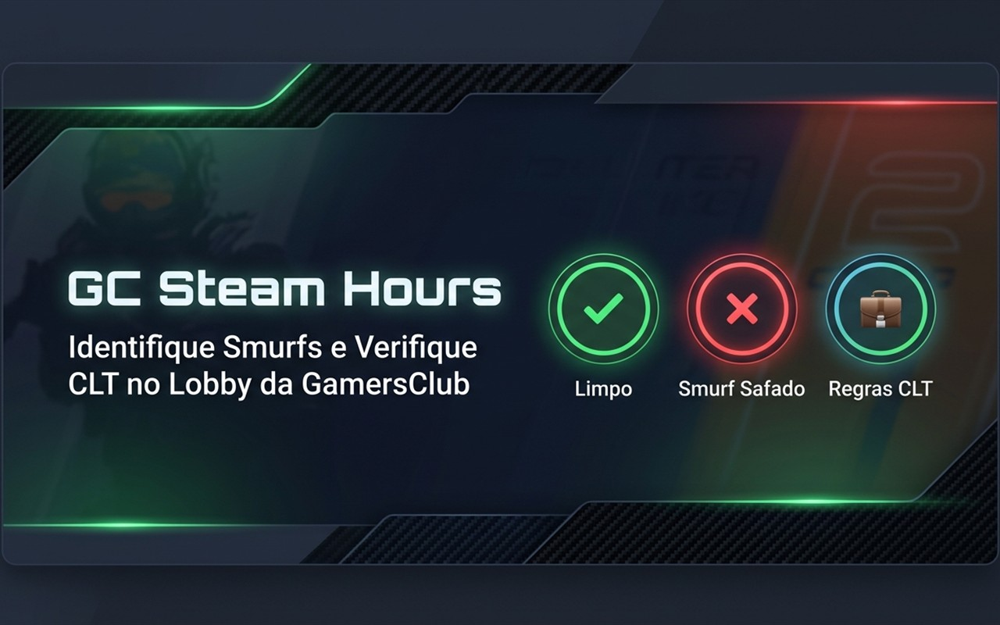

# GC Steam Hours 🎮🕒



**GC Steam Hours** é uma extensão para o Google Chrome que aprimora a experiência no lobby da **GamersClub**. Ela analisa a compatibilidade entre o nível do jogador (1 a 20) e suas horas de jogo registradas na Steam, ajudando a identificar potenciais contas "smurfs" e a monitorar a média diária de horas jogadas recentemente (o famoso "Controle de CLT").

---

## ✨ Funcionalidades

### 1. 🔍 Análise de Smurf (Compatibilidade de Nível vs Horas)
A extensão analisa automaticamente o nível do jogador na GamersClub e correlaciona com as horas jogadas na Steam, o KDR (Kill/Death Ratio) e o nível do perfil Steam:
*   **🟢 Limpo (`✔`)**: Horas compatíveis ou acima do mínimo esperado para o nível.
*   **🔴 Smurf Safado (`✖`)**: Horas abaixo do mínimo do nível **E** KDR alto ($\ge 0.95$) ou nível de conta Steam suspeito ($< 10$).
*   **🟡 Possível Smurf (`❓`)**: Horas abaixo do mínimo, porém com KDR baixo e nível da Steam normal.
*   **⚫ Privado (`🔒`)**: Perfil Steam ou detalhes de jogo configurados como privados.

### 2. 💼 Verificador de Horas Diárias (Controle CLT)
Analisa a média diária de horas de CS2 jogadas nas últimas duas semanas:
*   **🟢 CLT OK**: Média diária dentro do limite saudável configurado pelo usuário.
*   **🔴 Fora das Regras**: Média diária ultrapassa o limite saudável, indicando dedicação excessiva ao jogo.

### 3. ⚡ Otimização e Performance
*   **Fila de Concorrência Throttled**: Processa os jogadores em lotes de no máximo 3 simultaneamente, eliminando travamentos de tela em salas lotadas.
*   **Same-Origin Fetch**: Consultas aos perfis da GC feitas de forma direta e local, herdando a sessão do usuário e ignorando bloqueios 403 do Cloudflare.
*   **Cache Inteligente**: Armazena localmente os perfis e horas resolvidas por um tempo customizável para poupar requisições de API.

---

## ⚙️ Configurações Personalizadas

A página de opções da extensão permite configurar:
*   **Chave de API da Steam (Steam API Key)**: Necessária para efetuar as consultas de horas e nível do perfil.
*   **Tempo de TTL do Cache**: Tempo em minutos para expirar e revalidar os dados.
*   **Limite CLT**: Definição do limite de horas diárias permitidas (padrão de `3h`).
*   **Faixas de Horas por Nível**: Ajuste personalizado das horas mínimas esperadas para cada um dos níveis de 1 a 20 individualmente.

---

## 🛠️ Instalação para Desenvolvedores

Caso queira carregar e rodar a extensão localmente no modo de desenvolvedor do Chrome:

1. Faça o download ou clone este repositório:
   ```bash
   git clone https://github.com/vfgoncalves/gc-steam-hours.git
   ```
2. Abra o Google Chrome e navegue até `chrome://extensions/`.
3. Ative o **"Modo do desenvolvedor"** no canto superior direito.
4. Clique em **"Carregar sem compactação"** no canto superior esquerdo.
5. Selecione a pasta raiz deste projeto (`GcExtension`).
6. Abra as opções da extensão para configurar sua chave da Steam e comece a usar!

---

## 📝 Licença

Este projeto é de uso livre e utilitário. Sinta-se à vontade para contribuir abrindo Pull Requests na branch `develop` ou reportando Issues!
